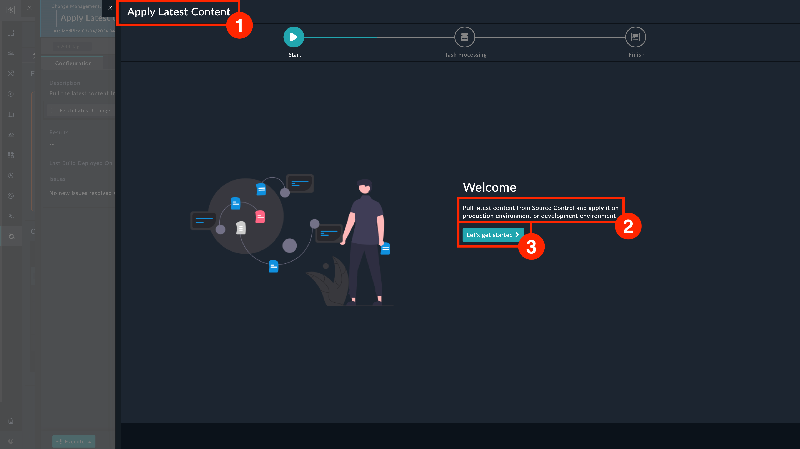
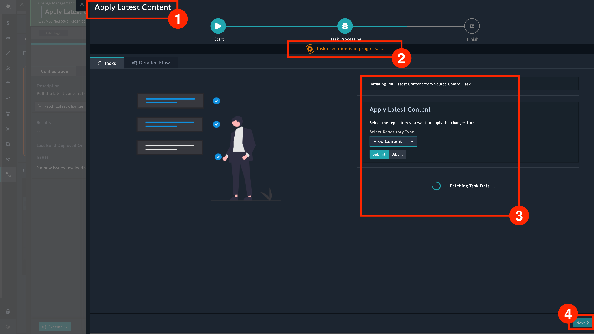
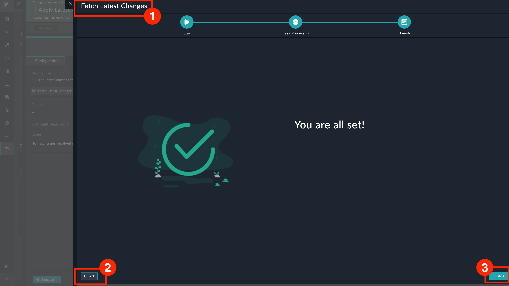

| [Home](../README.md) |
|----------------------|

# Usage

The **Playbook Execution Wizard** widget renders playbook execution logs and related comments on the wizard for a more fine-grained control on your processes.

This wizard can currently be used in tandem with the following widgets:

1. JSON to Grid Widget

2. Playbook Buttons Widget

Specify **Playbook Execution Wizard** within these widget's **Advanced** configuration settings. For more information, refer to the widgets' respective documentation.

## Playbook Execution Wizard

The wizard has 3 screens:

1. Start screen

    

    1. The name of the playbook being executed

    2. A short description of the playbook's function

    3. Click to move to next screen

2. Task Processing screen

    

    1. The name of the playbook being executed

    2. Task's progress

    3. Task's details

    4. Click to move to next screen

3. Finish screen

    

    1. The name of the playbook being executed

    2. Navigate to previous screen

    3. Click to finish

## Next Steps

| [Installation](./setup.md#installation) | [Configuration](./setup.md#configuration) |
|-----------------------------------------|-------------------------------------------|